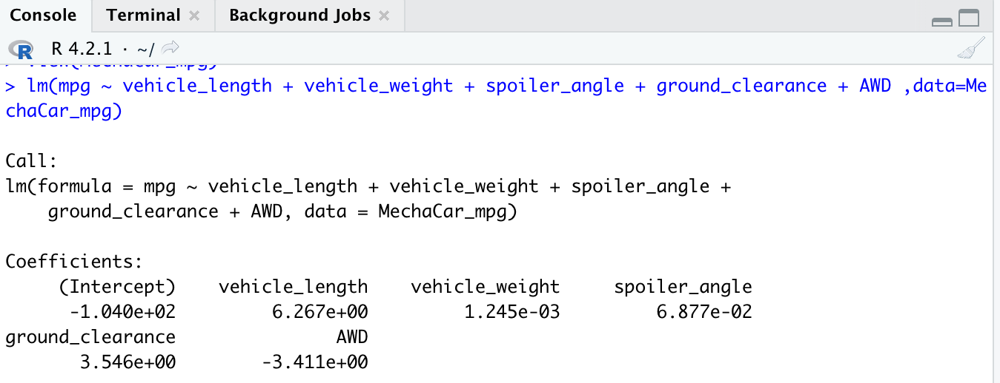
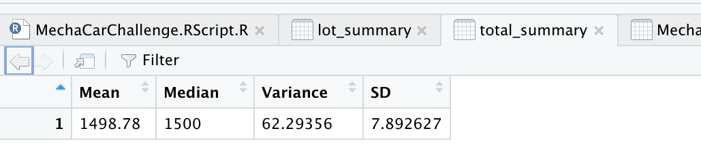
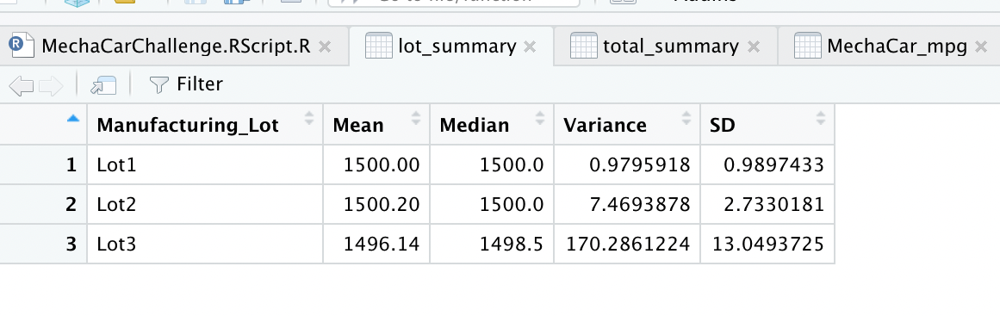
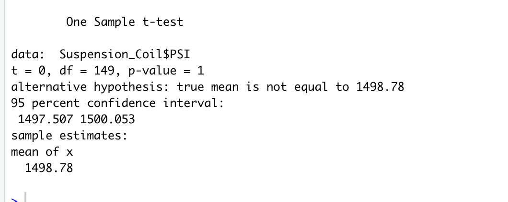
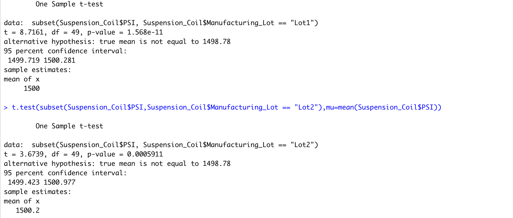
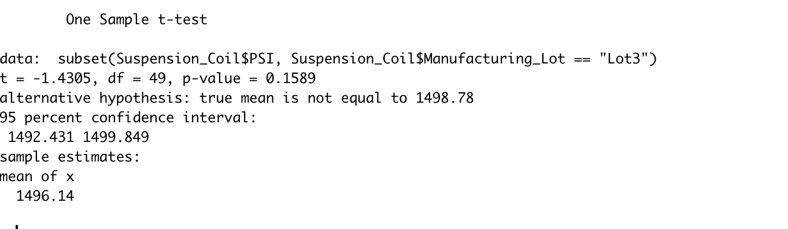

# MechaCar_Statistical_Analysis

The upper management of the company has requested a review of production data to gain insights into the cause of production troubles suffered by the manufactoring team.  

## Linear Regression to Predict MPG

.

Which variables/coefficients provided a non-random amount of variance to the mpg values in the dataset?

  Ground_clearance and vehicle_length are the coefficients that provided a non-random amount of variance.

Is the slope of the linear model considered to be zero? Why or why not?

  There is a positive correlation between all variables/coefficients. As seen in the image above, all coefficients are non-zero, therefore, the slope of     the linear model cannot be zero.  

Does this linear model predict mpg of MechaCar prototypes effectively? Why or why not?

  R-square is 0.71 (71%) shows a strong correlation of the model and dataset, thus, the linear model is fairly efficient to predict MPG of MechaCar         
  prototypes.
  

## Summary Statistics on Suspension Coils

.

The design specifications for the MechaCar suspension coils dictate that the variance of the suspension coils must not exceed 100 pounds per square inch. Does the current manufacturing data meet this design specification for all manufacturing lots in total and each lot individually? Why or why not?

The variance of the suspension coils for all manufactoring lots in total is 62 and within the design specifications. Looking at the individual lots, Lot1 and Lot2 are within the requirements, 0.98 & 7.47, respectively. Lot3 is well above the variance specifictations at 170.29 psi and serves as a large contibuter to the variance.  

## T-Tests on Suspension Coils

### t-Test for All Lots, pop mu = 1,500 psi

All Manufacturing Lots: p-value = 0.6028, alpha = 0.05 The total manufacturing lot is 0.60 > 0.05 and not statistically significant from the normal distribution. This means normality can be assumed. The mean falls within the 95% confidence interval.

.

### t-Test for Lot 1 & Lot 2

Lot 1: p-value = 1, alpha = 0.05 Lot 1 is 1 > 0.05, and not statistically significant from the normal distribution. This means normality can be assumed. The mean falls within the 95% confidence interval.

Lot 2: p-value = 0.6072, alpha = 0.05 Lot 2 is 0.60 > 0.05, and not statistically significant from the normal distribution. This means normality can be assumed. The mean falls within the 95% confidence interval.

.

### t-Test for Lot 3

Lot 3: p-value = 0.04168, alpha =0 .05 Lot 3 is 0.04 < 0.05, and it is statistically significant from the normal distribution. This means normality cannot be assumed. Although, the mean does fall within the 95% confidence interval.

.

After performing t-tests on the manufacturing lots we can see that the t-test for all lots shows no statistical difference from the population mean of 1500 PSI based on the p-value. The same is true for lots 1 and 2 individually. When we look at lot 3 however, we see there is a statistical difference based on the p-value of less than 0.05.

## Study Design: MechaCar vs Competition

### Metric to test:
To narrow down the test, we should evaluate MechaCar's carrying capacity in cubic inches in comparisson to competitor's vehicles as consumers take into consideration the capacity of the vehicle when purchasing.

### Null and Alternate Hypothesis:
MechaCar's prototype's mean capacity is similar to competitors and in the same vehicle class
MechaChar prototype's mean capacity is statistically above or below competitor vehicles.

### Statistical test used:
The best for this would be two t-tests on average carrying capacity data in cubic inches.
